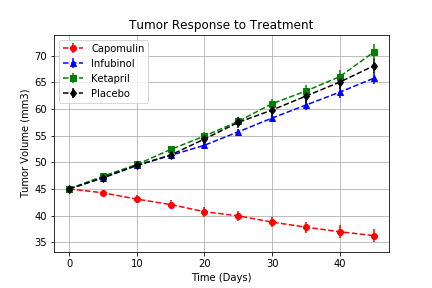
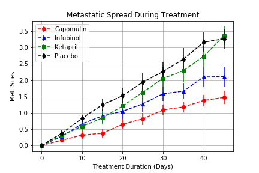
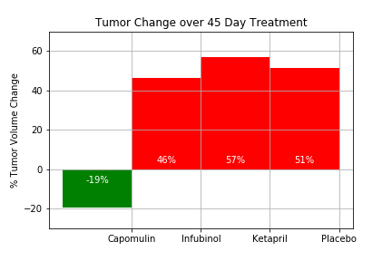

# Pymaceuticals

## Project Overview

The goal of this project is to analyze drug treatment on tumor volume, metastasis and survival using the Python with Pandas Library, and the Jupyter Notebook and Matplotlib.
1. Create a scatter plot that shows how the tumor volume changes over time for each treatment.
2. Create a scatter plot that shows how the number of metastatic sites changes over time for each treatment.
3. Create a scatter plot that shows the number of mice still alive through the course of treatment (Survival Rate (%))
4. Creating a bar graph that compares the total % tumor volume change for each drug across the full 45 days.

## Summary
1. Graph 'Tumor Response to Treatment' shows that the drug Capomulin had a better result, the tumors volume for the mice taking Capomulin shrunk in course of trial while for the mice taking the other drugs, tumors volume grew almost with the same rate.

2. Graph 'Metastatic Spread During Treatment' shows that all tumors had metastatic spread regardless of the drug, although the mice taking Capomulin had slowest metastatic spread and Placebo had the fastest spread.

3. Graph 'Survival During Treatment' shows that over 80% of the mice taking Capomullin has survived during the course of trial. For the other drugs survival rate dropped with almost same rate till day 30 and after that survival rate for Infubinol has significantly dropped.

4. According to these trends and tumor volume change percentage which we can see in the last graph, we could suggest Capomulin had the most favorable result between the compared drugs.

