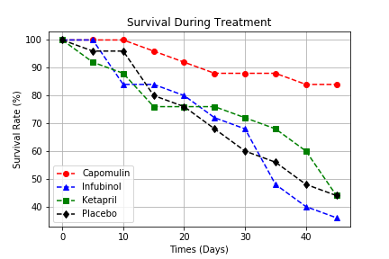

# Pymaceuticals

## Project Overview

While your data companions rushed off to jobs in finance and government, you remained adamant that science was the way for you. Staying true to your mission, you've since joined Pymaceuticals Inc., a burgeoning pharmaceutical company based out of Los Angeles, CA. Pymaceuticals specializes in drug-based, anti-cancer pharmaceuticals. In their most recent efforts, they've since begun screening for potential treatments to squamous cell carcinoma (SCC), a commonly occurring form of skin cancer.

As their Chief Data Analyst, you've been given access to the complete data from their most recent animal study. In this study, 250 mice were treated through a variety of drug regimes over the course of 45 days. Their physiological responses were then monitored over the course of that time. Your objective is to analyze the data to show how four treatments (Capomulin, Infubinol, Ketapril, and Placebo) compare.

The goal of this project is to analyze various drug treatment that affects tumor volume, metastasis and survival using Jupyter Notebook, Python, Matplotlib (data visualizations), and Pandas (data manipulation).

## Drug Treatment Analysis:
1. **Capomulin** is the only treatment that *reduces* tumor volume over time indicating it can potentially be the key to curing cancer. The other drug treatments increase tumor volume at the same rate as the placebo indicating it has little to no effect on reducing tumor volume or size.

2. Although none of the drugs completely stop metastatic spread, mice taking **Capomulin** have the slowest spread vs Infubionl, Ketapril, or the Placebo (the fastest spreading).

3. Over 80% of the mice taking **Capomulin** survive the trial, while the other mice only survive less than 50% of the time. Infubinol and Ketapril survival rates drop at a similar rate as the placebo. Then after 30 days mice treated with Infubinol were dying at a significantly higher rate than the placebo group indicating a red flag that Infubinol should could be doing more hurt than its helping.

4. **Capomulin** is the *only* treatment that sees tumor reduction indicating it is the most favorable drug in our experiement to reduce tumors and potentally cure cancer.

